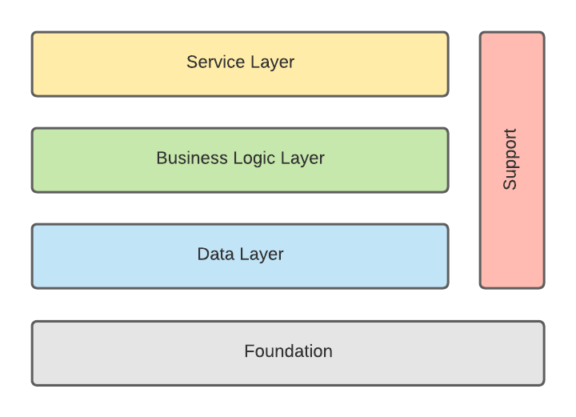

## Code Architecture

### Layers

Code is organised into layers, or areas of concern, and follows a 4 + 1 layer approach where we have the following layers:

The responsibility of the layers are:

**Service**

This is the entry to the application/service and is effectively the interface to the service. This will predominantly be event handlers; specifically Lambdas for handling ApiGateway, SNS events, etc.

**Business Logic**

This is the core application logic and should contain all business/domain logic.

**Data**

This should contain database and persistence logic including reading and writing to the database.

**Support**

This is where we put anything that’s not layer specific and could justifiably be used in any of the layers. This might include general helper/utility functions, etc.

**Foundation**

This should contain anything that underpins the whole service and would include things such as type declarations, configuration, constants, etc.

### Rules

This architecture has the following rules:

Higher layers can utilise lower layers, but not the other way around. For example the service layer can be aware of and call logic in the data layer, but the data layer should not aware of, or call logic in, the service layer.

The support layer is there to house basics support functionality and utility functions. In a nut shell, logic that is so general that it would be useful for any of the other layers could have access to it. An example might be a utility function that capitalises the first letter of each word. To maintain good separation of concerns, the support layer should not be aware of the other layers. For example, it should not make database calls.

### Directory Structure

This architecture is reflected in the directory structure used in the `src` directory:

- handlers - Service layer. Subdirectories can be used to group related handlers.
  - api
  - event
  - webhook
- logic - Business logic layer
- data-access - Data layer
- foundation - Foundation layer
- support - Utility functions and similar